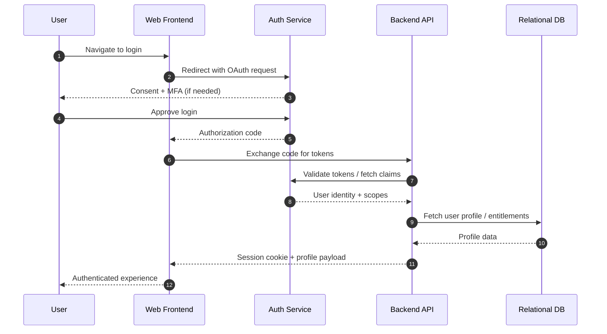
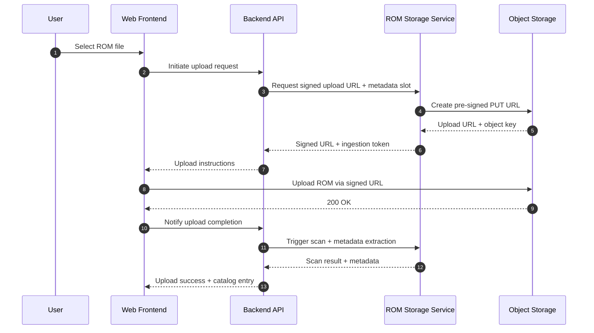
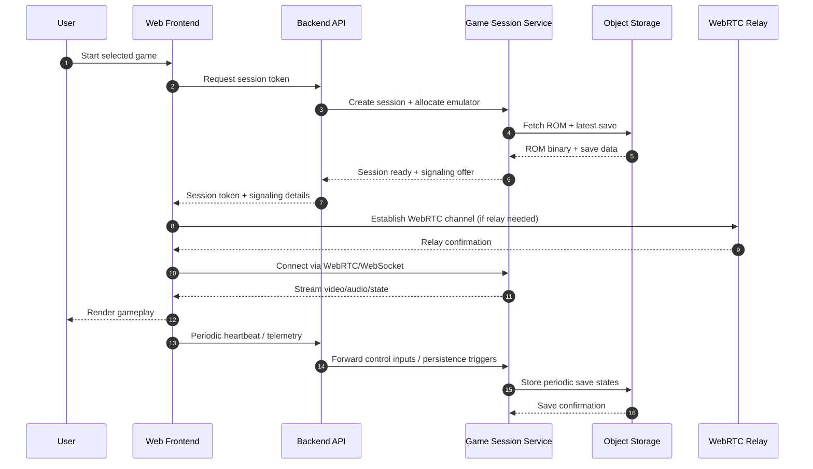

# Architecture Overview

This document provides a high-level reference for Treazr Island's end-to-end system interactions. It focuses on how the web frontend, backend platform, and supporting services collaborate to deliver authentication, ROM management, and retro game play sessions.

## System Diagram

```mermaid
graph TD
  subgraph Client
    A[Web Frontend (Next.js)]
  end

  subgraph Platform
    B[Backend API (NestJS)]
    C[Auth Service]
    D[ROM Storage Service]
    E[Game Session Service]
    F[Observability Stack]
  end

  subgraph External
    G[(Relational DB)]
    H[(Object Storage)]
    I[(WebRTC Relay / Matchmaking)]
  end

  A -- HTTPS/GraphQL --> B
  B -- OAuth/OpenID Connect --> C
  B -- Metadata + Binary --> D
  B -- Session Lifecycle --> E
  E -- State + Save Data --> H
  D -- ROM Assets --> H
  C -- User Profiles --> G
  B -- Persistence --> G
  E -- Telemetry --> F
  B -- Metrics/Logs --> F
  E -- Low-latency Streams --> I
  A -- WebRTC / WebSocket --> E
```

**Component Summary**

- **Web Frontend (Next.js)**: Renders the player dashboard, manages login flows, and hosts the in-browser emulator shell.
- **Backend API (NestJS)**: Central orchestrator that mediates authentication, ROM ingestion, and live game sessions.
- **Auth Service**: Wraps the identity provider (IdP) for secure OAuth/OIDC login, session issuance, and token validation.
- **ROM Storage Service**: Handles ROM uploads, virus scanning hooks, metadata extraction, and lifecycle storage policies.
- **Game Session Service**: Provides deterministic emulation hosting, state streaming, and save data persistence.
- **Observability Stack**: Central place for structured logs, metrics, and traces emitted from the backend and session services.
- **Relational DB**: Stores users, entitlements, catalog metadata, and session history.
- **Object Storage**: Houses ROM binaries, save states, and emulator artifacts.
- **WebRTC Relay / Matchmaking**: Supports peer-to-peer media channels or relayed sessions when clients cannot connect directly.

## Key Sequence Diagrams

### Authentication Flow



### ROM Upload Flow



### Play Session Flow



These diagrams should remain version-controlled within this Markdown file to keep architectural discussions transparent and auditable.
